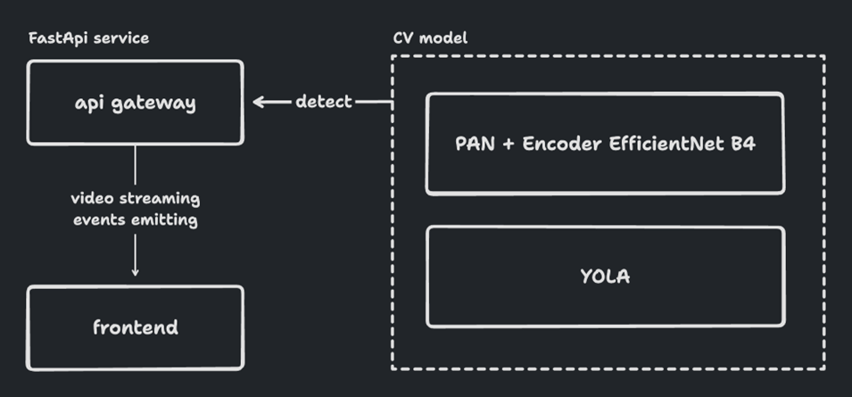

# Hacks AI 2023: Проект команды "Двоеточие скобочка"
 <a href="https://github.com/itmo-bootcamp/itmo-bootcamp-2023/blob/master/LICENSE"></a>
### Live-демо - https://hacks-ai.kladnitsky.ru/

## Кейс "Безопасный маршрут" от ОАО "РЖД"
При движении моторвагонного подвижного состава имеют место случаи выхода на маршрут следования людей, попадания посторонних предметов на железнодорожные пути или выезд автотранспорта. В таких ситуациях без преувеличения важна каждая секунда, и, если локомотивная бригада не принимает оперативных мер по причине отвлечения от контроля маршрута следования, может произойти трагедия. Аналогичные требования относятся и ко времени реагирования на случаи следования на «красный» сигнал светофора. Своевременное реагирование в данных ситуациях - это спасённые жизни и предотвращение случаев нарушения безопасности движения. 
Участникам хакатона предстоит создать систему контроля за состоянием пути, показанием светофоров (готовность маршрута), наличия посторонних лиц, предметов на железнодорожном полотне, препятствующих свободному следованию подвижного состава, приближающихся транспортных средств. Система должна анализировать видеопоток постоянно и при выявлении людей или посторонних предметов, запрещающего «красного» сигнала светофора иметь возможность послать сигнал на устройство световой и звуковой индикации.


## Стек технологий
### Frontend: React, Typescript, Vite, Mantine UI
### Backend: Python, FastAPI
### ML & CV: Yolo, PAN, EfficientNet, OpenCV, ffmpeg
### DevOps: Docker, Registy, Github Actions

## Архитектура 



## Frontend
Приложение представляет собой Single Page Application, доступ к которому осуществляется через Nginx. Для развертывания на своей локальной машине можно воспользоваться следующими командами:
```
cd frontend
npm i
npm run dev
```

Также приложение собирается в Docker-образ, доступный для скачивания по адресу:
https://hub.docker.com/repository/docker/danyakladnitsky/hacks-ai-2023.frontend

Для развертывания фронтенда можно воспользоваться более удобной командой, если на целевой машине установлен Docker, порт 80:
```
docker compose -f docker-compose.frontend.yml up --build
```
## ML & CV

Модель сегментации (EfficientNet B4 encoder + Pyramid Attention Network decoder) выделяет железнодорожный путь, по которому движется локомотив. Чтобы выделить опасную зону, по которой не должны проходить люди или транспорт, с помощью методов cv2 эрозии и гауссовского размытия увеличивается область железнодорожного пути. Yolov5 обнаруживает людей, если человек заходит за область, определенную моделью сегментации, машинисту отправляется сигнал, что надо быть более бдительным.

С работой модели можно ознакомиться в демо или запустив ноутбук `submission_notebook.ipynb`.

## CI/CD
В ходе разработки приложения был настроен процесс непрерывной поставки кода на два сервера. Один для обслуживания запросов к фронтенд-части, другой - для развертывания CV-сервисов и API Gateway-сервиса, который также доступен в Docker-регистре:
https://hub.docker.com/repository/docker/danyakladnitsky/hacks-ai-2023.backend


